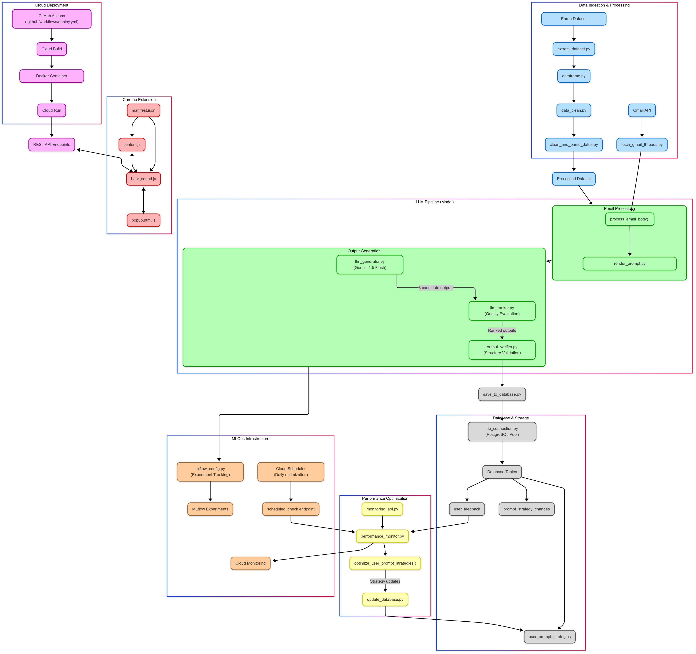

# MailMate – AI-powered Email Assistant

## Overview

MailMate is an AI-powered email assistant designed to help professionals tackle email overload. The system combines advanced data pipeline processing with state-of-the-art LLM technology to provide three key services:

1. **Email Summarization** - Quickly understand the key points of long email threads
2. **Action Item Extraction** - Automatically identify tasks and deadlines from emails
3. **Draft Reply Generation** - Create contextually relevant, professional responses with a single click

MailMate offers contextual understanding through a Chrome extension that integrates directly with Gmail, helping users reduce the time spent managing their inbox.

## Project Components

This project consists of three main components:

### 1. Data Pipeline

Our data pipeline handles the ingestion, preprocessing, and quality control of email data. It uses Apache Airflow for orchestration and includes rigorous data validation with Great Expectations.

[See Data Pipeline Documentation](data_pipeline/README.md)

### 2. Model Pipeline

The model pipeline powers the AI behind MailMate, utilizing Google's Vertex AI Gemini models with custom prompt engineering and a sophisticated ranking system for high-quality outputs.

[See Model Pipeline Documentation](model_pipeline/README.md)

### 3. Chrome Extension

A user-friendly Chrome extension that integrates directly with Gmail, allowing users to leverage MailMate's AI capabilities with just a few clicks.

[Instructions are part of the Model Pipeline Documentation](model_pipeline/README.md)

## Tech Stack

- **Data Processing**: Python, Airflow, Great Expectations, DVC
- **AI/ML**: Vertex AI (Gemini 1.5 Flash), MLflow, spaCy
- **Backend**: Flask, PostgreSQL, Cloud Run, Cloud SQL
- **Frontend**: Chrome Extension (JavaScript/HTML/CSS)
- **DevOps**: Docker, GitHub Actions, GCP

## Project Scope

[See Scoping Document](scoping.pdf)

## Architecture Diagram

## Project Setup

See the respective documentation for [data pipeline](data_pipeline/README.md) and [model pipeline](model_pipeline/README.md) for more detailed setup instructions.

To get the app (frontend and backend) up and running, follow the [model pipeline](model_pipeline/README.md) instructions.

## Video Demonstration

For a complete walkthrough of the system, watch our demonstration: [Video Link](https://drive.google.com/file/d/1Jr1CoPq95whpQ-tOgsVYKPlwb9RK5W4s/view?usp=sharing)

## Team Members

- [Shubh Desai](https://github.com/username)
- [Pushkar Kurhekar](https://github.com/username)
- [Aalap Desai](https://github.com/desaiaalap)
- [Deep Prajapati](https://github.com/username)
- [Shubham Mendapara](https://github.com/username)

## License

This project is provided for educational purposes. See [LICENSE](LICENSE) for details.
